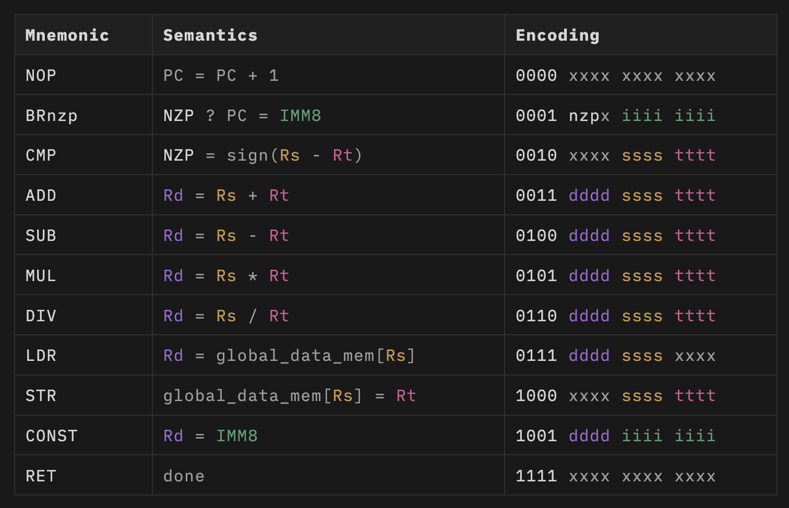

# tiny gpu sim

## 概述

这是一个 基于 tiny gpu 源码进行实现 的 gpu 仿真项目 . 

肝了点时间 简单的写一下使用方法。等我把我头上的 “达摩克利斯之剑”拔了再修补剩下的bug 

如果感兴趣 向了解gpu 怎么运转的同学可以估计是一个不错的材料～

因为有很多模块 都是 直接简单粗暴的绘制～ 只有到后期 肝到 大一点的模块线路太复杂 不得不模块化～ 

巴拉巴拉～ 省略 n个字～

##  运行效果

### 如何启动：

主要文件直接打开： [gpu](./gpu.circ)

将 test_demo_1.ram 和 test_demo_1.ram  加载到 rom 和 ram 然后 给个 线程数 和 打开时钟 和 start 开关就可以了

## 目前存在的bug

1. 因为时间不充裕，ram 的读取本来是需要 4通道 并行的。 但是“偷工减料”使用一个控制器控制ram 的读写操作， 但是因为过于简单粗暴，使用串行的去实现 ，然后就是当 mem_write_channels 和 mem_read_channels 分配通道的时候 如果恰巧 高位没操作完 低位突然有效的时候，就会出现bug ～ 不过这几天没空去修bug 国庆后有空再实现4通道的控制器控制ram吧～ （/手动狗头）

### 指令集：

